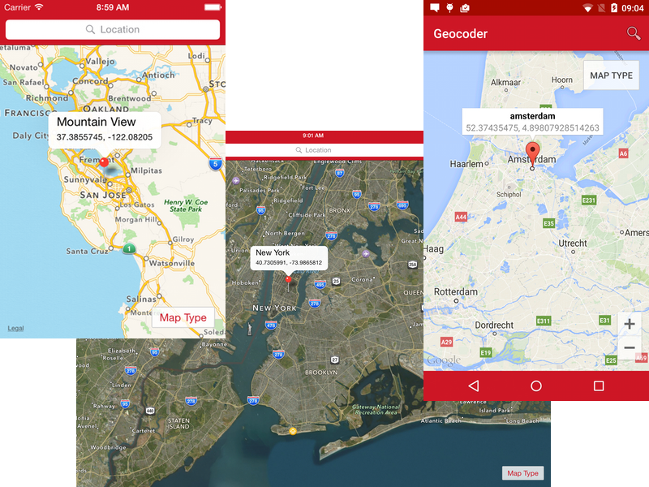

# Titanium Alloy Geocoder Sample
This is a Titanium Mobile sample app that uses native maps to plot locations. With it you can forward geocode addresses to add them as annotations, and reverse geocode your current position or via a longpress on the map.

As you'll [see](app/controllers/index.js) the code is heavily documented to tell you exactly what is going on.

Let's run through some of the main topics covered.

## Custom Android Material Theme
For Android, the app uses a [custom Android Material Theme](http://docs.appcelerator.com/platform/latest/#!/guide/Android_Themes-section-34636181_AndroidThemes-MaterialTheme). Material made it much easier to create custom Android themes and all you have to do is override some of the default colors in [platform/android/res/values/custom_theme.xml](platform/android/res/values/custom_theme.xml) and select the style name in [tiapp.xml](tiapp.xml) under *android/manifest/application@android:theme*.

* Guide: [Android Themes](http://docs.appcelerator.com/platform/latest/#!/guide/Android_Themes)

## Config: [config.json](app/config.json)
For iOS we wanted to make it easy to change our primary brand color as well. It's set in [app/config.json](alloy/app/config.json) under *global/brandPrimary* and read as `Alloy.CFG.brandPrimary` in [app/styles/index.tss](app/styles/index.tss) for example. As you can read in the guide, we could even set a different value for this propery based on the platform and environment the app runs on.

* Guide: [Project Configuration File (config.json)](http://docs.appcelerator.com/platform/latest/#!/guide/Project_Configuration_File_(config.json))

## Globals: [alloy.js](app/alloy.js)
Another global under Alloy is `Alloy.Globals`. This object is empty and can be populated anywhere, but in most cases you will use `alloy.js` for this. This fill end up in Titanium's bootstrap `Resources/app.js` file. Since that file is global scope, it's a best practice to wrap your code in a self-executing function.

For iOS we set a global to `20dp`. We'll use this in a *Global Style* to move our content down below the statusBar, leaving the actual Window start behind it, allowing us to style it.

* Guide [Initializer File](http://docs.appcelerator.com/platform/latest/#!/guide/Alloy_Controllers-section-34636384_AlloyControllers-InitializerFile(alloy.js))

## Global Styles: [app.tss](app/styles/app.tss)
Even though this app only has one view, it's a best practice to use [app/styles/app.tss](app/styles/app.tss) for your base styles. It's an ideal place to override platform defaults, like the color of a `Label`, which is grey on Android instead of black like the others.

For this app this is also where play with the Window and canvas to give the statusBar a red backgroundColor. See *Globals* for more information.

* Guide: [Alloy Styles and Themes](http://docs.appcelerator.com/platform/latest/#!/guide/Alloy_Styles_and_Themes)

## Conditional Code
As the screenshots show, we use platform specific UI elements to provide the best user experience. Still, all platforms share the same [app/views/index.xml](app/views/index.xml). We use the `platform="<os>"` attribute to determine on which platform(s) a view (and it's descendants) should render. We also use conditional code in our [styles](app/styles/app.tss) and [controller](app/controllers/index.js).

* Guides:
  * [Views: Conditional Code](http://docs.appcelerator.com/platform/latest/#!/guide/Alloy_XML_Markup-section-35621528_AlloyXMLMarkup-ConditionalCode)
  * [Styles: Conditional Statements](http://docs.appcelerator.com/platform/latest/#!/guide/Alloy_Styles_and_Themes-section-35621526_AlloyStylesandThemes-ExampleusingConditionalStatements)
  * [Controllers: Conditional Code](http://docs.appcelerator.com/platform/latest/#!/guide/Alloy_Controllers-section-34636384_AlloyControllers-ConditionalCode)

## Map Module
Since 3.2.0 the core [Ti.Map](http://docs.appcelerator.com/platform/latest/#!/api/Titanium.Map) module for Google Maps v1 has been replaced by the add-on [ti.map](http://docs.appcelerator.com/platform/latest/#!/api/Modules.Map) module for Google Maps v2 and iOS Map Kit.

To use this module, we need to add it to [tiapp.xml](tiapp.xml) and use the powerful [module attribute](http://docs.appcelerator.com/platform/latest/#!/guide/Alloy_XML_Markup-section-35621528_AlloyXMLMarkup-ModuleAttribute) in our [index.xml](app/views/index.xml) to use the module as a view factory.

For Android, the module needs a [Google API key](http://docs.appcelerator.com/platform/latest/#!/guide/Google_Maps_v2_for_Android-section-36739898_GoogleMapsv2forAndroid-ObtainandAddaGoogleAPIKey), which is linked to the app id and keystore. The sample app includes a key for the sample app id and the bundled keystore that our SDKs default to.

* Guides:
  * [Map Module](http://docs.appcelerator.com/platform/latest/#!/api/Modules.Map)
  * [iOS Map Kit](http://docs.appcelerator.com/platform/latest/#!/guide/iOS_Map_Kit)

## Geolocation
To forward and reverse geocode locations on the map, we use `Ti.Geolocation`. This uses [MapQuest Open Nominatim Search Service](http://open.mapquestapi.com/nominatim/). While this API has the advantage that it has no daily usage limits, please note that the data backing this API is crowd sourced and might not return proper values for valid addresses and geographic coordinates. If geocoding services are essential component of the application, developers are encouraged to use commercial geocoding providers.

## Strict Mode
All the functions in the [controller](app/controllers/index.js) begin with `'use strict';`. Although this app is simple, strict mode can dramatically increas the performance of your app because the JavaScript engine will assume as smaller, stricter subset of ECMAScript. Unfortunately you cannot add `'use strict';` as the first line of the controller because Alloy wraps your code where it is no longer the first line of the file or function. We're working on that.

## FIXME
Throughout the code you'll find a couple of `FIXME` or `TODO` comments. This is a standard way to document things that need to be fixed in a next release. Many editors, including Appcelerator Studio mark these lines and even collect them in a handy todo-list.

If you include JIRA ticker number or full URL in a `FIXME` comment, you can use the [tickets CLI](npmjs.com/tickets) to quickly scan your project and lookup the current status of the issues. A great way to see if you can remove some workarounds after a new Titanium SDK release.
